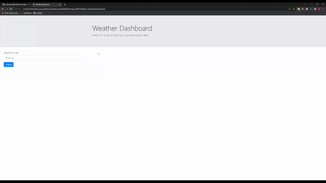

# HW6-Weather-Dashboard

## Deploy Link

https://pbarkley.github.io/HW6-Weather-Dashboard/

## Installation

- Click the 'Deploy Link' above
            OR
- git clone git@github.com:pbarkley/HW6-Weather-Dashboard.git

## Description

This is a webpage that displays weather information. When the user inputs a city, a card appears displaying the current day, temperature, humidity, wind speed, and uv index for their current location. 

## Webpage Gif

## Credits

- Pat Barkley